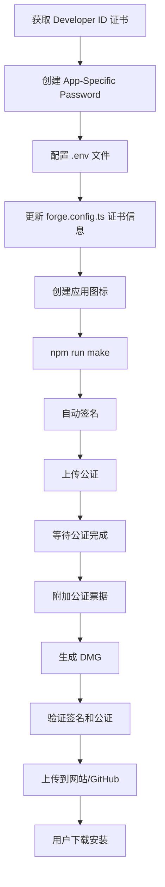

# Typeless 分发指南（策略 A：公证分发）

这个指南将帮你完成代码签名、公证、并分发 Typeless 应用。

## 📋 前置准备清单

### 1. Apple Developer 账号
- ✅ 已有 Apple Developer Program 会员资格（$99/年）
- ✅ 访问 https://developer.apple.com/account

### 2. 获取 Developer ID 证书

#### 方式 A：通过 Xcode（推荐）
1. 打开 Xcode
2. Preferences → Accounts → 添加你的 Apple ID
3. 选择你的团队 → Manage Certificates
4. 点击 "+" → 选择 "Developer ID Application"
5. 证书会自动下载到 Keychain

#### 方式 B：通过网页
1. 访问 https://developer.apple.com/account/resources/certificates/list
2. 点击 "+" 创建新证书
3. 选择 **Developer ID Application**
4. 上传 CSR（在 Keychain Access 中生成）
5. 下载并双击安装

### 3. 创建 App-Specific Password

1. 访问 https://appleid.apple.com/account/manage
2. Sign-In and Security → App-Specific Passwords
3. 点击 "+" 生成新密码
4. 输入名称（如 "Typeless Notarization"）
5. **复制密码**（格式：`xxxx-xxxx-xxxx-xxxx`）

### 4. 获取 Team ID

1. 访问 https://developer.apple.com/account
2. 右上角显示的 **10位字符**就是你的 Team ID
3. 或者在 Membership 页面查看

---

## 🔧 配置步骤

### 步骤 1：创建环境变量文件

```bash
# 复制模板
cp .env.example .env

# 编辑 .env 文件，填入真实值
# APPLE_ID=your-email@example.com
# APPLE_ID_PASSWORD=xxxx-xxxx-xxxx-xxxx
# APPLE_TEAM_ID=XXXXXXXXXX
```

⚠️ **注意**：`.env` 已在 `.gitignore` 中，不会被提交到 Git

### 步骤 2：更新证书身份信息

编辑 `forge.config.ts`，找到这一行：

```typescript
identity: 'Developer ID Application: YOUR_NAME (TEAM_ID)',
```

替换为你的实际信息（在 Keychain Access 中查看证书的完整名称）：

```typescript
identity: 'Developer ID Application: Jun Yu Wang (AB12CD34EF)',
```

### 步骤 3：创建应用图标

你需要一个 `.icns` 格式的图标文件。

#### 方式 A：使用在线工具
1. 访问 https://cloudconvert.com/png-to-icns
2. 上传 1024x1024 的 PNG 图标
3. 转换并下载 `.icns` 文件
4. 保存到 `assets/icon.icns`

#### 方式 B：使用命令行
```bash
# 创建 assets 目录
mkdir -p assets

# 使用 iconutil（需要先准备 iconset）
iconutil -c icns assets/icon.iconset -o assets/icon.icns
```

如果暂时没有图标，可以先注释掉 `forge.config.ts` 中的 `icon` 配置行。

---

## 🏗️ 构建和公证

### 本地测试构建（不签名）

```bash
# 开发模式运行
npm start

# 打包但不签名（测试用）
npm run package
```

### 正式构建（签名 + 公证）

```bash
# 确保环境变量已配置
source .env

# 构建并自动签名 + 公证
npm run make
```

**构建过程：**
1. 🔨 编译代码（Vite + Electron）
2. 📦 打包应用（生成 `.app`）
3. ✍️ 代码签名（使用 Developer ID）
4. 📤 上传到 Apple 公证服务器
5. ⏳ 等待公证（通常 1-5 分钟）
6. 📥 下载公证票据并附加到应用
7. 💿 创建 DMG 安装包

**输出文件位置：**
```
out/
├── make/
│   └── Typeless-0.1.0-arm64.dmg    # 最终分发文件
└── Typeless-darwin-arm64/
    └── Typeless.app                # 已签名的应用
```

---

## ✅ 验证签名和公证

### 检查代码签名

```bash
# 检查签名是否有效
codesign --verify --deep --strict out/Typeless-darwin-arm64/Typeless.app

# 查看签名详情
codesign -dvv out/Typeless-darwin-arm64/Typeless.app

# 应该显示类似：
# Authority=Developer ID Application: YOUR_NAME (TEAM_ID)
# Signed Time=...
# Runtime Version=...
```

### 检查公证状态

```bash
# 检查公证票据
spctl -a -vv out/Typeless-darwin-arm64/Typeless.app

# 成功公证应该显示：
# accepted
# source=Notarized Developer ID
```

### 检查 DMG

```bash
# 检查 DMG 签名
codesign -dvv out/make/Typeless-0.1.0-arm64.dmg
```

---

## 🚀 分发方式

### 方式 1：直接下载（推荐）

1. **上传到网站/GitHub Releases**
   ```bash
   # 将 DMG 上传到你的网站或 GitHub Releases
   # 用户下载后双击安装即可
   ```

2. **用户安装流程**
   - 下载 `Typeless-0.1.0-arm64.dmg`
   - 双击打开 DMG
   - 拖动 Typeless.app 到 Applications 文件夹
   - 首次打开需要：
     - 允许"来自互联网下载的应用"
     - 授予麦克风权限
     - 授予辅助功能权限

### 方式 2：Homebrew Cask

创建一个 Homebrew Cask 配方：

```ruby
cask "typeless" do
  version "0.1.0"
  sha256 "..."  # DMG 文件的 SHA-256

  url "https://your-website.com/downloads/Typeless-#{version}-arm64.dmg"
  name "Typeless"
  desc "Voice-to-text transcription tool"
  homepage "https://your-website.com"

  app "Typeless.app"
end
```

用户安装：
```bash
brew install --cask typeless
```

### 方式 3：Sparkle 自动更新

未来可以集成 Sparkle 框架实现应用内自动更新。

---

## 🐛 常见问题

### 问题 1：公证失败 - "The binary is not signed with a valid Developer ID"

**解决方案**：
- 确认证书类型是 **Developer ID Application**（不是 Mac App Distribution）
- 检查 Keychain 中证书是否有效（未过期）

### 问题 2：公证失败 - "The executable does not have the hardened runtime enabled"

**解决方案**：
- 确认 `forge.config.ts` 中 `'hardened-runtime': true`
- 重新构建

### 问题 3：用户打开应用提示"已损坏"

**原因**：macOS Gatekeeper 检测到应用未公证

**解决方案**：
```bash
# 临时移除隔离属性（仅用于测试）
xattr -cr /Applications/Typeless.app

# 正式发布必须完成公证
```

### 问题 4：辅助功能权限无法授予

**解决方案**：
1. 系统设置 → 隐私与安全性 → 辅助功能
2. 点击 "+" 添加 Typeless
3. 或拖动 Typeless 到列表中

---

## 📊 完整流程总结



---

## 🔒 安全注意事项

1. **永远不要提交 `.env` 文件到 Git**
2. **不要在公开渠道分享 App-Specific Password**
3. **定期更换 App-Specific Password**
4. **保护好你的 Developer ID 证书私钥**

---

## 📚 参考资料

- [Apple 公证指南](https://developer.apple.com/documentation/security/notarizing_macos_software_before_distribution)
- [Electron Forge 文档](https://www.electronforge.io/)
- [Code Signing Guide](https://developer.apple.com/support/code-signing/)

---

**准备好了吗？** 开始配置并构建你的第一个公证版本吧！ 🚀
